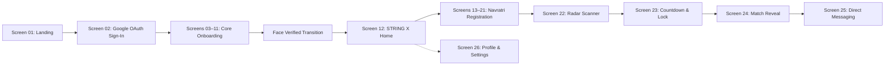

# STRING X — Developer Documentation

Welcome to the comprehensive developer documentation for **STRING X**.

STRING X is a high-energy, campus-focused social matchmaking application designed for university festivals and cultural connections (featuring Google OAuth campus authentication, live face verification, campus vibe matching, and partner countdown reveal).

---

## Technology Stack

- **Frontend Core:** React 19 (`react`, `react-dom`)
- **Language:** TypeScript 5.8+ (`typescript`, `tsx`)
- **Build & Dev Tooling:** Vite 8 (`vite`, `@vitejs/plugin-react`)
- **Styling & Design System:** Tailwind CSS v4 (`tailwindcss`, `@tailwindcss/vite`), Vanilla CSS tokens
- **Animations:** Motion (`motion/react`)
- **Computer Vision / Face Verification:** Pico.js local face detection cascade (`pico.ts`, `faceValidation.ts`)
- **Effects:** Canvas Confetti (`canvas-confetti`)
- **Icons:** Lucide React (`lucide-react`)
- **Backend & Database:** Supabase (`@supabase/supabase-js`)
- **Backend & Database:** Supabase (`@supabase/supabase-js`)
  - **Auth:** Google OAuth with campus identity, enrollment number extraction, and `allowed_auth_emails` allowlist bypass *(Note: University domain restriction is TEMPORARILY PAUSED)*
  - **Database:** Supabase PostgreSQL with Row Level Security (RLS) & unified verification state engine (19 physical tables + 3 projection views)
  - **Storage:** Supabase Storage (`profile-photos` bucket)
  - **Realtime:** Realtime platform statistics publication (`platform_statistics`) and 1-to-1 active match messaging channel (`messages:${matchId}`)

---

## Main Product Flow



1. **Landing (`/`):** Full-bleed festival illustration, core branding, Google OAuth entry CTA.
2. **Google Sign-In (`/auth`):** Supabase Google OAuth authenticating campus students with enrollment number extraction or developer allowlist bypass (`allowed_auth_emails`). *(Note: PU email restriction is TEMPORARILY PAUSED; historical prototype used Phone OTP).*
3. **Core Profile Onboarding (`/onboarding` Steps 0–8):**
   - Step 01: Name & Gender
   - Step 02: Campus & Hostel Selection
   - Step 03: Age Picker
   - Step 04: Festive Profile Photo Upload / Avatar Presets
   - Step 05: Height Ruler & Weight Dial
   - Step 06: Home State Selector
   - Step 07: College Year Cards
   - Step 08: Department & Course Selection
   - Step 09: Live Webcam Face Verification (Pico ML cascade model with geolocation capture)
4. **Verification Celebration (`/onboarding/verified`):** 1.5s celebratory animation transition.
5. **STRING X Home (`/home`):** Campus events feed, live Navratri 2026 banner, dynamic verification status banner, and profile link.
6. **Navratri Vibe Registration (`/events/navratri` Steps 9–17):**
   - Step 01: Partner Gender Preference
   - Step 02: Campus Interests
   - Step 03: Favourite Campus Evening Spot
   - Step 04: Navratri Excitement Level Slider
   - Step 05: Garba Skill Level Selector
   - Step 06: Navratri Vibes (up to 3)
   - Step 07: Personality Prompt 01 (Stay or Slay)
   - Step 08: Personality Prompt 02 (Energy & Chaos)
   - Step 09: Instagram Handle Input
7. **Radar Scanner (`/match/scanning`):** Procedural candidate signal generator and campus search radar.
8. **Countdown & Lock Screen (`/match/countdown`):** Live days/hours/minutes countdown ticker. Evaluates active match reveal flags (`connections.user_a_revealed` & `connections.user_b_revealed`) and automatically transitions to Match Reveal when both flags become true.
9. **Match Reveal (`/match/reveal`):** Dual-frame "It's a Match" screen displaying real authenticated user profile and real matched partner resolved securely through `v_matched_profiles` and storage buckets.
10. **Direct 1-to-1 Messaging (`/match/messages`):** Real-time festival chat for revealed matches backed by `public.messages`, mutual block enforcement (`is_pair_blocked()`), and Supabase Realtime subscriptions.
11. **Profile & Settings (`/profile`):** Campus status, profile card, notifications, privacy, account deletion, and sign-out modal.

---

## Project Structure

```
string-x/
├── docs/                        # Complete technical documentation (authoritative documentation suite)
├── public/                      # Static assets & Pico ML models (/models/facefinder)
├── src/
│   ├── app/                     # Application shell, router, and composite providers
│   ├── components/              # UI primitives, inputs, illustrations, and dev tools
│   │   ├── dev/                 # DevScreenRail (desktop 25-screen jump rail)
│   │   ├── events/              # Event discovery feeds and questionnaire layouts
│   │   ├── illustrations/       # Badges, SVG artwork, and logo components
│   │   ├── inputs/              # 20 specialized custom interactive inputs
│   │   ├── screens/             # Screen presentation adapters
│   │   └── ui/                  # DeviceFrame, HeaderNav, PrimaryButton
│   ├── constants/               # Route mappings and static metadata
│   ├── data/                    # Mock data, preset avatars, and event questions
│   ├── features/                # Domain-specific contexts and hooks (auth, onboarding)
│   ├── hooks/                   # Public hooks (useAuth, useOnboarding)
│   ├── lib/                     # Supabase client singleton, env config, and DB types
│   ├── pages/                   # Isolated page components & individual step views
│   ├── services/                # Business logic & Supabase data access layer
│   ├── types/                   # Centralized domain and API type definitions
│   └── utils/                   # Pico face detector and geometry validation
├── supabase/
│   └── migrations/              # 17-migration sequential PostgreSQL database schema
├── ARCHITECTURE_REFACTOR_PLAN.md   # Initial refactor plan
├── ARCHITECTURE_REFACTOR_REPORT.md # Refactor migration report
├── CONTRIBUTING.md              # Engineering guidelines and pull request standards
└── README.md                    # Root project overview and quickstart
```

---

## Quick Start

```bash
# 1. Install dependencies
npm install --legacy-peer-deps

# 2. Configure environment (copy template)
cp .env.example .env.local

# 3. Start local development server
npm run dev

# 4. Run typecheck / lint
npm run lint

# 5. Build for production
npm run build
```

---

## Documentation Index

| Topic | Document | Description |
|---|---|---|
| **Architecture** | [architecture.md](architecture.md) | System design, uni-directional data flow, and layers |
| **Database Specification** | [database.md](database.md) | PostgreSQL schema, tables, types, RPCs, messaging, and trigger sync |
| **Database ERD** | [database-erd.md](database-erd.md) | Entity relationship diagrams and physical table schemas (19 tables + 3 views) |
| **Database Security** | [database-security.md](database-security.md) | Row Level Security (RLS) policies, security definer helpers, and column-level security |
| **Migrations Manifest** | [migrations.md](migrations.md) | 17-migration sequence, rollback guidance, execution order, and DB vs Frontend distinction |
| **Authentication** | [authentication.md](authentication.md) | Google OAuth, email allowlist, temporary PU pause status, and session management |
| **Routing** | [routing.md](routing.md) | Route map, DevScreenRail indexing, match reveal transitions, and navigation logic |
| **Onboarding** | [onboarding.md](onboarding.md) | Detailed specs for Screens 03–11 and 13–21 |
| **Matchmaking** | [matchmaking.md](matchmaking.md) | Vibe scoring, verification gate, pair-level reveal flags, and partner resolution |
| **Messaging** | [messaging.md](messaging.md) | Direct 1-to-1 chat, `public.messages`, pair-block helper, RLS, and Realtime sync |
| **Design System** | [design.md](design.md) | Neo-brutalist festive aesthetics, colors, typography, badges, Screen 24, and Screen 25 |
| **Components** | [components.md](components.md) | Catalogue of UI primitives, interactive inputs, and screen adapters |
| **Services** | [services.md](services.md) | Service layer API specifications, messagingService, and error handling |
| **State Management**| [state-management.md](state-management.md) | AuthContext, OnboardingContext, and local UI state |
| **Storage** | [storage.md](storage.md) | Supabase Storage bucket setup, paths, and photo handling |
| **Security** | [security.md](security.md) | RLS, credential isolation, pair block security, and input sanitization |
| **Environment** | [environment.md](environment.md) | Environment variable definitions and fallbacks |
| **Development** | [development.md](development.md) | Local development workflow, scripts, and debugging |
| **Deployment** | [deployment.md](deployment.md) | Production builds, preview hosting, and Cloud Run |
| **Testing** | [testing.md](testing.md) | Quality assurance, browser testing, and checklists |
| **Troubleshooting** | [troubleshooting.md](troubleshooting.md) | Common errors, root causes, and resolutions |
| **Internal API** | [api.md](api.md) | Service layer function signatures and payloads |
| **Decisions (ADRs)**| [decisions.md](decisions.md) | Architecture Decision Records (ADR 01 through ADR 25) |
| **Changelog** | [changelog.md](changelog.md) | History of releases through v2.11.0 + Unreleased (Messaging V1, Reveal Fixes) |
| **Audit** | [documentation-audit.md](documentation-audit.md) | Coverage, verified paths, and known technical debt |
