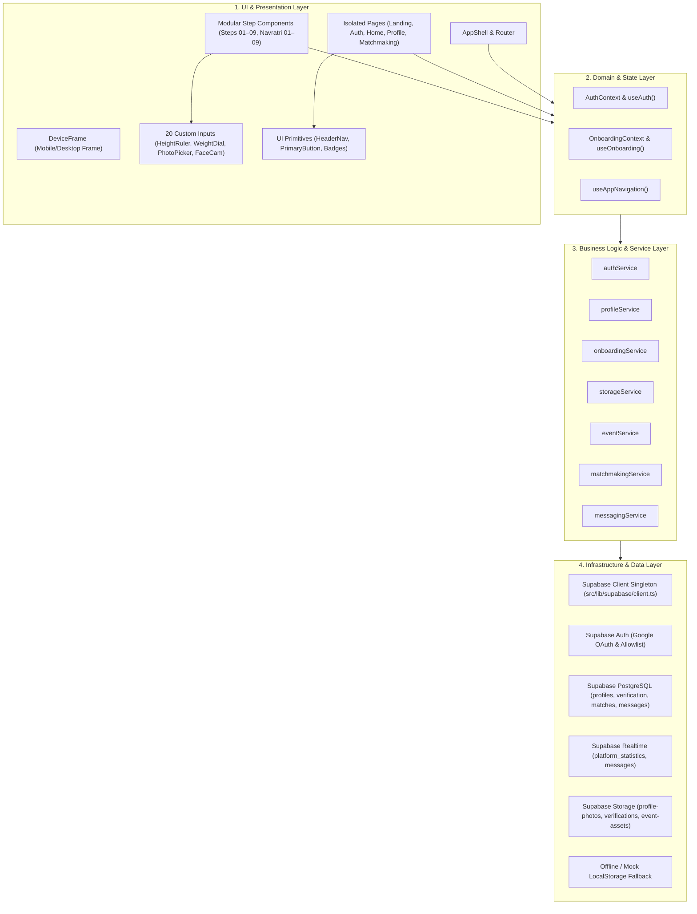
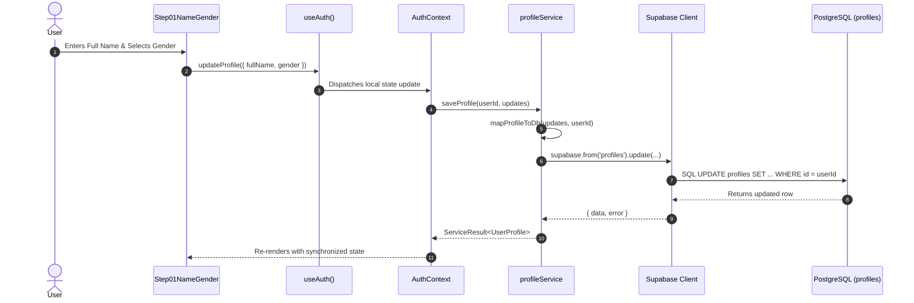

# STRING X — System Architecture

> **Version:** 3.0.0  
> **Status:** APPROVED ARCHITECTURAL SPECIFICATION (LAYER ISOLATION & GOOGLE OAUTH IDENTITY)  
> **Target Framework:** React 19 + TypeScript + Vite 8  
> **Backend Engine:** Supabase (Auth, PostgreSQL 15+, Storage, Realtime)  

---

## 1. Architectural Philosophy

STRING X is architected around **strict layer isolation**, **uni-directional data flow**, and **zero coupling between presentation and database operations**.



---

## 2. Layer Responsibilities & Rationale

### Layer 1: UI & Presentation Layer (`src/pages/`, `src/components/`)
- **Role:** Pure presentation, user input collection, animations, and triggering domain actions.
- **Strict Rule:** Must NEVER import `@supabase/supabase-js`, execute database queries, or contain persistence logic.
- **Why It Exists:** Ensures changing the UI design, replacing a button style, or altering an animation cannot break backend contracts, database queries, or other pages.

### Layer 2: Domain Context & Hooks Layer (`src/features/`, `src/hooks/`)
- **Role:** Coordinates client state across screens, manages active step progression, auto-advance timers, and centralizes authentication state listeners.
- **Key Modules:**
  - `AuthContext`: Tracks `user`, `session`, `profile`, `status` (`loading | authenticated | unauthenticated`), and completion booleans. Handles deduplication and startup deadlock recovery.
  - `OnboardingContext`: Tracks `step` (`0..17`), triggers step validation, and cleans up timers.
  - `useAppNavigation`: Maps named routes (`AppRoute`) and the 24 screens in `DevScreenRail`.
- **Why It Exists:** Avoids prop-drilling across deep component trees and guarantees a single source of truth for sessions and active profiles.

### Layer 3: Service Layer (`src/services/`)
- **Role:** Pure business logic and data access abstraction. Each service is an async TypeScript object returning a standardized `ServiceResult<T>`:
  ```typescript
  export interface ServiceResult<T> {
    data: T | null;
    error: ServiceError | null;
  }
  ```
- **Key Services:**
  - `authService.ts`: Dispatches Google OAuth authentication, evaluates domain allowlists, handles account deletion RPC, and retrieves active sessions.
  - `profileService.ts`: Fetches and updates profiles, converts DB schemas (`DatabaseProfile`) to UI entities (`UserProfile`), submits DP/Face verification attempts, and manages lookup caches.
  - `onboardingService.ts`: Validates steps and manages transient draft persistence.
  - `storageService.ts`: Uploads media to Supabase Storage (`profile-photos`, `verifications`) and handles base64 data URLs.
  - `eventService.ts`: Queries active campus events, evaluates database registration truth, and persists questionnaire vibe answers.
  - `matchmakingService.ts`: Queries active pairings (`v_my_matches`), evaluates connection reveal flags, subscribes to real-time match events, and provides partner compatibility insights.
  - `messagingService.ts`: Fetches chronological message history (`public.messages`), transmits new messages, and subscribes to realtime channel `messages:${matchId}`.
- **Why It Exists:** Decouples the application from Supabase. If the backend switches from Supabase to another persistence engine, only the service layer needs modification; the UI remains 100% untouched.

### Layer 4: Infrastructure & Client Layer (`src/lib/supabase/`)
- **Role:** Instantiates the Supabase client singleton with session persistence and type safety.
- **Key Modules:**
  - `client.ts`: Exports `supabase: SupabaseClient<Database>`.
  - `env.ts`: Detects whether real Supabase environment variables are provided.
  - `types.ts`: TypeScript interfaces representing PostgreSQL database schemas.
- **Why It Exists:** Prevents multiple client instances, ensures unified session management, and provides full TypeScript autocompletion for SQL tables.

---

## 3. Dependency Rules

Enforced import direction:
```
Pages ──> Hooks / Contexts ──> Services ──> Supabase Client ──> PostgreSQL / Storage
  │             │                   │
  └───> UI ─────┴─────────> Types ──┘
```

1. **Pages & Steps** may import: Components, Hooks, Constants, Domain Types.
2. **Components** may import: UI Primitives, Domain Types, Utilities.
3. **Hooks** may import: Services, Domain Types, Constants.
4. **Services** may import: Supabase Client, Database Types, Domain Types, Utilities.
5. **Supabase Client** must NEVER import Pages, Components, or Hooks.
6. **Types** must NEVER import UI code.

---

## 4. End-to-End Data Flow



---

## 5. Page Isolation Pattern

Every screen in `src/pages/` follows the **Single Responsibility Principle**. For example:

```tsx
// src/pages/onboarding/steps/Step03Age.tsx
export const Step03Age: React.FC<Step03AgeProps> = ({ profile, onUpdateProfile }) => {
  return (
    <div className="space-y-4">
      <div>
        <PlayfulBadge text="AGE CHECK" color="yellow" tilt="left" />
        <h2 className="text-3xl font-black text-[#251436] tracking-tight mt-2">
          How old are you?
        </h2>
        <p className="text-xs font-semibold text-[#251436]/70 mt-1">
          Swipe or tap to set your age.
        </p>
      </div>

      <AgeSelector
        value={profile.age}
        onChange={(age) => onUpdateProfile({ age })}
      />
    </div>
  );
};
```

- Zero Supabase query logic.
- Zero navigation side effects.
- Clean props contract (`profile` in, `onUpdateProfile` out).
- Reusable across any container or test runner.

---

## 6. Offline / Mock Fallback Resilience

The architecture includes a built-in **Smart Fallback Engine**:
1. When `VITE_SUPABASE_URL` and `VITE_SUPABASE_ANON_KEY` are populated with valid credentials, all services execute against live Supabase endpoints.
2. In preview, local testing, or when environment variables are omitted, services automatically route state through `localStorage` with identical async behavior.
3. The frontend never crashes or throws unhandled `Missing Environment Variable` errors during initial development.

---

## 7. Onboarding Lifecycle & Completion Architecture

1. **Google OAuth Profile Photo Isolation:**
   OAuth user metadata (`avatar_url`, `picture`) is strictly reserved for identity and never copied into the application profile photo state. Step 04 Photo onboarding starts empty, requiring the user to explicitly upload or capture their own picture.
2. **University Foreign Key Resolution:**
   Frontend campus selection is resolved to `public.universities(id)` via `resolveUniversityId()` using whitespace normalization, case-insensitive comparison, and static fallbacks for seeded institutions. If resolution fails, step advancement is blocked and existing database values are protected from null overwrites.
3. **Database-Driven Registration Gate:**
   Completion status is derived solely from database truth: `onboarding_status === 'completed' && is_profile_completed === true`. Returning completed users bypass onboarding and are routed directly to Page 12 (`AppRoute.HOME`), while incomplete users resume at their saved database step. Pre-flight loading states inside `DeviceFrame` eliminate onboarding screen flashing during session initialization.
4. **Account Deletion, Active Storage Cleanup & 30-Day Retention Archive:**
   Users can initiate account deletion from `ProfileSettingsScreen`. The user-facing confirmation modal communicates that the action is permanent, active profile/photos/account data are removed, the user is signed out, and returning with the same Google account starts registration anew from the beginning (internal archive tables are never mentioned in the UI). When confirmed, active storage files in `profile-photos` and `verifications` buckets are purged, and the server-side PostgreSQL RPC `delete_user_account()` writes a compliance snapshot to `public.deleted_accounts` with `deleted_at = now()` before deleting the `auth.users` row. This cascades to active profiles, photos, and match records while completely releasing the Google email identity in Supabase Auth.
5. **Main Profile Photo vs. Face Verification Separation:**
   Main DP resolves exclusively from the user photo uploaded in Step 04 and stored in `public.profile_photos` in the `profile-photos` bucket. Biometric face verification selfies reside in the private `verifications` bucket and are strictly blocked from being displayed as avatars, match imagery, or public cards. Fallbacks to face verification or Google OAuth avatars are prohibited.
6. **Event Flow Navigation Architecture (Navratri 2026):**
   The Navratri matching questionnaire begins at Step 9 (`NavratriStep01Partner`) within `OnboardingFlowContainer` via `AppRoute.ONBOARDING`. Completed registered users enter this flow from the Home screen's "Find My Match" button without re-triggering core registration. The `AppShell` routing guard specifically bypasses core registration steps (`onboardingStep < 9`), permitting completed users to freely navigate event matching questions (steps 9–17) and transition to submission success (`AppRoute.SUCCESS`) and countdown reveal (`AppRoute.COUNTDOWN`).
7. **Matchmaking Waiting Radar & Real Match Gating:**
   The matchmaking waiting screen (`SubmissionSuccessScreen` / `AppRoute.SUCCESS`) displays continuous radar sweeps, candidate signal pulses, and oscillating scan wave progress without prematurely transitioning to "Strings Attached" (`CountdownScreen` / `AppRoute.COUNTDOWN`). The user remains on the matchmaking screen indefinitely while searching or evaluating. Transition to countdown reveal occurs strictly upon receiving a confirmed active match result from the backend (`public.matches` / `v_my_matches`) via polling and Supabase Realtime changes. Progress bars, timers, and animations never trigger navigation.
