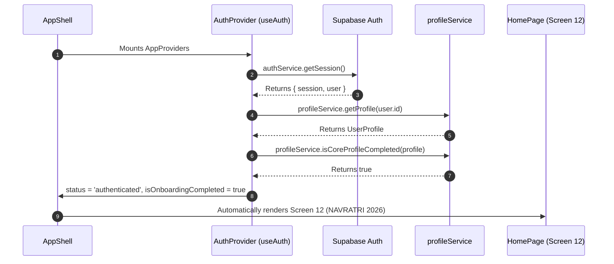
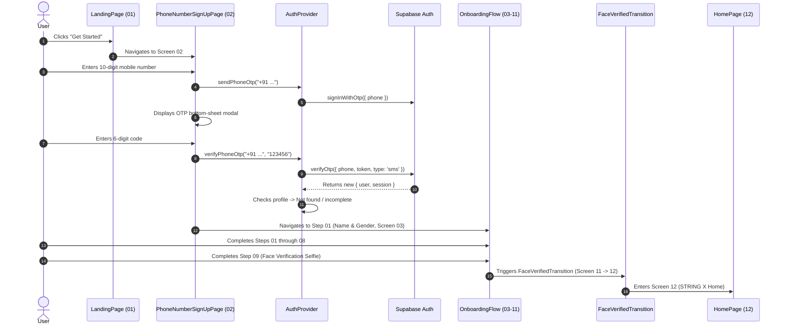

# STRING X — Authentication Architecture

## 1. Authentication Overview

Authentication in STRING X is powered by **Supabase Auth** using passwordless **SMS Phone OTP (One-Time Password)**.

The system enforces a strict state machine distinguishing 4 user states:
1. `loading`: Initializing session from Supabase on application startup.
2. `unauthenticated`: Logged-out visitor (eligible for Landing Page and Phone Sign-Up).
3. `authenticated` (incomplete profile): User has a valid session but has not completed Steps 01 to 09.
4. `authenticated` (complete profile): User has a valid session and completed profile; auto-routed to Screen 12 (`HomePage` / Navratri 2026).

---

## 2. Authentication Flow Cases

### CASE 1: Existing Logged-in User (Session Restoration)


---

### CASE 2: New User Registration & Onboarding


---

### CASE 3: Existing User Logging in on a New Device
1. User starts on Screen 01 (`LandingPage`).
2. Navigates to Screen 02 (`PhoneNumberSignUpPage`).
3. Enters their existing registered phone number.
4. Enters the 6-digit OTP code.
5. Supabase Auth returns their existing `user` account.
6. `profileService.getProfile(user.id)` fetches their existing profile from PostgreSQL.
7. `profileService.isCoreProfileCompleted(profile)` evaluates to `true`.
8. The app immediately bypasses Steps 03–11 and transitions directly to **Screen 12 (`HomePage`)**.
9. **Zero duplicate users or duplicate profiles are created.**

---

## 3. AuthContext API Specification

The `AuthContext` provides a centralized API accessible via the `useAuth()` hook:

```typescript
export interface AuthContextValue {
  // Session & user status
  status: 'loading' | 'authenticated' | 'unauthenticated';
  loading: boolean;
  user: User | null;
  session: Session | null;
  isAuthenticated: boolean;

  // Profile status
  profile: UserProfile;
  profileLoading: boolean;
  isOnboardingCompleted: boolean;
  isNavratriCompleted: boolean;

  // Action methods
  sendPhoneOtp: (phone: string) => Promise<{ success: boolean; error?: string }>;
  verifyPhoneOtp: (
    phone: string,
    token: string
  ) => Promise<{ success: boolean; error?: string; isExistingUser?: boolean }>;
  updateProfile: (updates: Partial<UserProfile>) => Promise<void>;
  setProfileLocal: (profileOrFn: UserProfile | ((prev: UserProfile) => UserProfile)) => void;
  signOut: () => Promise<void>;
  refreshProfile: () => Promise<void>;
}
```

---

## 4. Auth State Listeners

In `src/features/auth/context/AuthContext.tsx`, an active listener subscribes to Supabase auth events on mount:

```typescript
const unsubscribe = authService.onAuthStateChange(async (_event, newSession) => {
  if (newSession?.user) {
    setUser(newSession.user);
    setSession(newSession);
    setStatus('authenticated');
    await loadUserProfile(newSession.user.id);
  } else {
    setUser(null);
    setSession(null);
    setStatus('unauthenticated');
  }
});
```

- When the user signs out from another tab or invalidates their token, all active views instantly react.
- Tokens are automatically refreshed in the background via Supabase auto-refresh.

---

## 5. Security & Verification Rules

1. **Source of Truth:** The Supabase session is the sole source of truth for authentication. LocalStorage is only used by Supabase SDK for session caching and by the mock fallback layer in offline environments.
2. **Phone Sanitization:** Phone numbers are cleaned with `.replace(/\D/g, '')` and prepended with international country code `+91` before submission.
3. **No Service-Role Key in Client:** All client-side auth uses the anonymous public key (`VITE_SUPABASE_ANON_KEY`).
