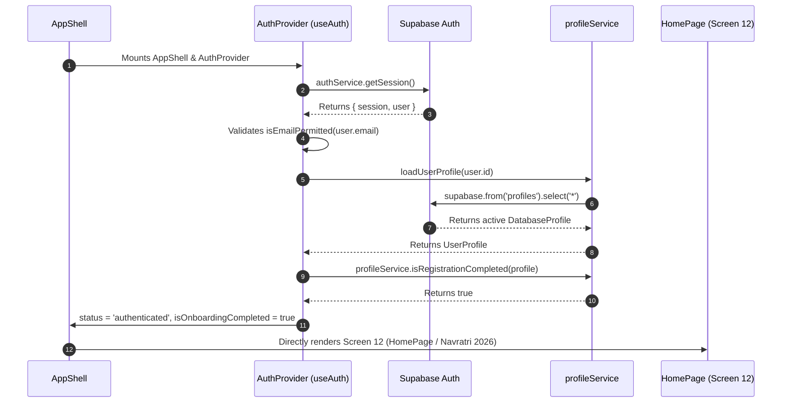
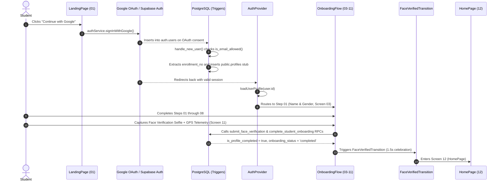

# STRING X — Authentication Architecture

> **Version:** 3.0.0  
> **Status:** APPROVED ARCHITECTURAL SPECIFICATION (GOOGLE OAUTH & PARUL UNIVERSITY ALLOWLIST)  
> **Primary Identity Provider:** Supabase Auth (Google OAuth)  
> **Target Domain:** `@paruluniversity.ac.in`  
> **Bypass Registry:** `public.allowed_auth_emails`  

---

## 1. Authentication Overview

Authentication in STRING X is powered by **Supabase Auth** using **Google OAuth** as the primary authentication mechanism. The platform strictly enforces institutional enrollment: access is restricted to official Parul University student accounts (`@paruluniversity.ac.in`) alongside an administrative allowlist bypass (`public.allowed_auth_emails`) for developer, tester, and app-store review accounts.

*(Historical Note: Early prototype iterations implemented passwordless SMS Phone OTP. Phone authentication is currently locked in the UI and retained strictly as legacy/prototype reference).*

The system enforces a strict state machine distinguishing 4 user states:
1. `loading`: Initializing session and hydrating profile from Supabase on application startup.
2. `unauthenticated`: Logged-out visitor (eligible for Landing Page and Google Sign-In).
3. `authenticated` (incomplete profile): User has a valid Google OAuth session but has not completed Core Onboarding (Steps 01 to 09).
4. `authenticated` (complete profile): User has a valid session and completed profile (`onboarding_status = 'completed'` AND `is_profile_completed = true`); auto-routed to Page 12 (`HomePage` / Navratri 2026).

---

## 2. Authentication Flow & Lifecycle

```
                           Student opens String X
                                     ↓
                          Landing Page (Screen 01)
                                     ↓
                       Clicks "Continue with Google"
                                     ↓
                          Google OAuth Consent Screen
                                     ↓
                     Redirect to Supabase Auth Callback
                                     ↓
                          handle_new_user() Trigger
                                     ↓
                      is_email_allowed(auth.users.email)?
                     ├── NO  → Sign out + Auth Error Modal
                     └── YES → Extract enrollment_no + Seed profiles stub
                                     ↓
                         AuthContext Session Listener
                                     ↓
                      loadUserProfile(user.id) [Deduplicated]
                                     ↓
                   isRegistrationCompleted(profile)?
                   ├── YES → Route to Page 12 (HomePage)
                   └── NO  → Resume at profile.onboardingStep
```

### CASE 1: Returning Student with Completed Profile (Session Restoration)


---

### CASE 2: New Student Google Sign-In & Core Onboarding


---

### CASE 3: Non-University / Unauthorized Email Rejection
1. Visitor attempts Google Sign-In with an unauthorized personal account (e.g. `user@gmail.com`).
2. Post-redirect, `AuthContext` and `handle_new_user()` evaluate `authService.isEmailPermitted(email)`.
3. The email fails both the official Parul University regex (`^[0-9]+@paruluniversity\.ac\.in$`) and allowlist lookup in `public.allowed_auth_emails`.
4. `authService.signOut()` is executed immediately.
5. `AuthContext` sets `authError` notice:
   - **Title:** `"Parul University Account Required"`
   - **Message:** `"StringX is currently available only to Parul University students and approved developer accounts. Please sign in with your Parul University Google account."`
6. Application returns cleanly to **Screen 01 (`LandingPage`)** displaying the branded error modal.

---

## 3. AuthContext & Startup Deadlock Protection

Because intermittent startup deadlocks can occur during complex async session hydration, `AuthContext.tsx` implements robust protection mechanisms:

1. **In-Flight Profile Load Deduplication:** `inFlightProfilePromiseRef` caches active promises by `userId` to avoid duplicate concurrent fetches during initial mount and `onAuthStateChange` events.
2. **Guaranteed Cleanup in `finally` Block:** `setProfileLoading(false)` is guaranteed to execute in a `finally` block, preventing unhandled network exceptions from permanently freezing the UI at `"LOADING YOUR PROFILE..."`.
3. **8-Second Initialization Safety Timeout:** A safety timer guarantees that if session initialization or profile hydration is stalled by browser network constraints, `status` transitions out of `'loading'` and clears `profileLoading`.
4. **Resilient Lookup Timeouts:** Lookups in `profileService.loadLookups()` are bounded by a 5-second timeout with deterministic static fallback data for Parul University, Sumandeep Vidyapeeth, and standard courses.

---

## 4. AuthContext API Specification

The `AuthContext` provides a centralized API accessible via the `useAuth()` hook:

```typescript
export interface AuthErrorNotice {
  title: string;
  message: string;
}

export interface AuthContextValue {
  // Session & user status
  status: 'loading' | 'authenticated' | 'unauthenticated';
  loading: boolean;
  user: User | null;
  session: Session | null;
  isAuthenticated: boolean;

  // Profile status
  profile: UserProfile;
  profileLoading: boolean;
  isOnboardingCompleted: boolean;
  isNavratriCompleted: boolean;

  // Error feedback
  authError: AuthErrorNotice | null;
  setAuthErrorNotice: (notice: AuthErrorNotice | null) => void;
  clearAuthError: () => void;

  // Action methods
  signInWithGoogle: () => Promise<{ success: boolean; error?: string }>;
  sendPhoneOtp: (phone: string) => Promise<{ success: boolean; error?: string }>;
  verifyPhoneOtp: (
    phone: string,
    token: string
  ) => Promise<{ success: boolean; error?: string; isExistingUser?: boolean }>;
  updateProfile: (updates: Partial<UserProfile>, step?: number) => Promise<void>;
  completeOnboarding: () => Promise<{ success: boolean; error?: string }>;
  setProfileLocal: (profileOrFn: UserProfile | ((prev: UserProfile) => UserProfile)) => void;
  signOut: () => Promise<void>;
  deleteAccount: () => Promise<{ success: boolean; error?: string }>;
  refreshProfile: () => Promise<void>;
}
```

---

## 5. Account Deletion Architecture

Account deletion is executed atomically via the server-side PostgreSQL function `public.delete_user_account()`:

1. **User Initiation:** Initiated from `ProfileSettingsPage` via the "Delete Account" action and confirmation modal.
2. **Atomic Archival:** The `delete_user_account()` RPC copies the active profile to `public.deleted_accounts` with `deleted_at = now()` for 30-day compliance retention.
3. **Storage Purge:** User-owned assets in `profile-photos` and `verifications` storage buckets are purged.
4. **Auth Cascade Deletion:** The user row is deleted directly from `auth.users`, which automatically cascades across `public.profiles`, `public.profile_photos`, `public.verification`, `user_interests`, `matches`, and `connections`.
5. **Clean Re-Registration:** Because the `auth.users` row is deleted, the student can re-authenticate later using their Google account without "user already exists" collisions.

---

## 6. Security & Verification Rules

1. **Source of Truth:** Supabase Auth (`auth.users`) and the verified JWT token are the sole authoritative sources of authentication.
2. **Email Immutability:** `profiles.email` and `profiles.enrollment_no` are protected by database trigger `trg_enforce_profile_email_identity`. Normal users cannot modify their institutional email address.
3. **No Service-Role Key in Client:** All client-side requests utilize the anonymous public key (`VITE_SUPABASE_ANON_KEY`) with Row Level Security (RLS) enforcement.
