# STRING X — Database Entity-Relationship Diagram (ERD)

This document provides the visual and structural Entity-Relationship Diagram (ERD) for the STRING X database architecture using Mermaid syntax.

---

## 1. Complete System ERD (18 Physical Tables + 3 Projection Views)

```mermaid
erDiagram
    "auth.users" ||--|| profiles : "identifies (1:1 PK = FK)"
    "auth.users" ||--o{ admin_users : "admin role (1:1)"
    "auth.users" ||--o{ matches : "audits/creates (created_by)"
    "auth.users" ||--o{ verification : "attempts (1:N)"
    
    universities ||--o{ profiles : "enrolled in (N:1)"
    hostels ||--o{ profiles : "resides in (N:1, composite FK)"
    courses ||--o{ profiles : "pursues (N:1)"
    universities ||--o{ hostels : "manages (1:N)"
    universities ||--o{ courses : "offers (1:N)"
    
    profiles ||--o{ profile_photos : "owns (1:N, owner-only RLS)"
    profiles ||--o{ user_interests : "has (1:N, owner-only RLS)"
    interests ||--o{ user_interests : "tagged by (1:N)"
    
    profile_photos ||--o{ verification : "moderates (0..1:N)"
    
    events ||--o{ event_registrations : "hosts (1:N)"
    universities ||--o{ events : "hosts campus (N:1)"
    profiles ||--o{ event_registrations : "explicitly attends (1:N)"
    
    event_registrations ||--|| event_preferences : "completes (1:1)"
    
    events ||--o{ matches : "contains (1:N)"
    profiles ||--o{ matches : "matched as user_a (1:N)"
    profiles ||--o{ matches : "matched as user_b (1:N)"
    
    matches ||--|| connections : "attaches string (1:1)"
    profiles ||--o{ connections : "connects as user_a"
    profiles ||--o{ connections : "connects as user_b"
    
    profiles ||--o{ user_blocks : "blocks (blocker)"
    profiles ||--o{ user_blocks : "blocked by (blocked)"
    profiles ||--o{ user_reports : "reports (reporter)"
    profiles ||--o{ user_reports : "reported (reported)"

    %% =========================================================================
    %% ENTITY DEFINITIONS
    %% =========================================================================

    "auth.users" {
        uuid id PK "Supabase internal auth identifier"
        text email UK "Google OAuth authenticated email"
        text phone "Optional verified phone number"
        timestamptz created_at "Account creation timestamp"
        timestamptz email_confirmed_at "OAuth confirmation timestamp"
    }

    allowed_auth_emails {
        text email PK "Normalized lowercase developer/tester email bypass"
    }

    platform_statistics {
        text id PK "Singleton 'global'"
        integer total_profiles "Trigger-maintained registered profile count"
        timestamptz updated_at
    }

    admin_users {
        uuid user_id PK, FK "References auth.users.id"
        text role "'super_admin' | 'admin' | 'moderator'"
        timestamptz created_at
    }

    universities {
        uuid id PK
        text name UK "Unique campus title (Parul University)"
        text slug UK "parul-university"
        text city "Vadodara"
        text state "Gujarat"
        text campus_code "PU"
        boolean is_active "true = operational, false = coming soon modal"
        timestamptz created_at
        timestamptz updated_at
    }

    hostels {
        uuid id PK
        uuid university_id FK "References universities.id"
        text name "Sarojini, Tagore, etc."
        text gender_designation "'female' | 'male' | 'coed'"
        boolean is_on_campus "true = hostel, false = off-campus"
        integer display_order "Order in UI selection sheet"
        boolean is_active
        timestamptz created_at
    }

    courses {
        uuid id PK
        text name "B.Tech, MBA, BCA, B.Sc"
        text academic_level "'undergraduate' | 'postgraduate' | 'diploma'"
        uuid university_id FK "Optional specific campus link"
        boolean is_popular "Displayed as quick chips"
        integer display_order
        boolean is_active
        timestamptz created_at
    }

    interests {
        uuid id PK
        text name UK "Late Night Chai, Anime, Gaming"
        text slug UK "late-night-chai"
        text category "Lifestyle, Creative, Sports"
        text icon "Optional emoji"
        boolean is_active
        timestamptz created_at
    }

    profiles {
        uuid id PK, FK "Primary Key matching auth.users.id"
        text user_code UK "Admin-facing human-readable ID (SX001, SX002, ...)"
        text email UK "Authoritative user email synchronized from auth.users"
        text enrollment_no "Extracted numeric university enrollment number"
        text full_name "Legal/display name"
        text gender "'Female' | 'Male' | 'Non-binary'"
        smallint birth_year "Year of birth (1990-2015)"
        uuid university_id FK "References universities.id"
        uuid hostel_id FK "References hostels.id (composite checked)"
        uuid course_id FK "References courses.id"
        text study_year "'1st Year' | '2nd Year' | '3rd Year' | 'PG'"
        text home_state "Indian state or UT"
        smallint height_cm "Height in centimeters"
        numeric weight_kg "Restored weight in kg (30-250 kg)"
        text instagram_id "Verified social handle"
        text verification_status "'pending' | 'verified' | 'rejected' (Cached from latest verification attempt)"
        text face_verification_path "Transitional compatibility storage path"
        boolean is_premium "Authoritative active premium state (Phase 1)"
        timestamptz premium_started_at
        timestamptz premium_expires_at "Future subscription expiry"
        text onboarding_status "'in_progress' | 'completed'"
        smallint onboarding_step "Current step (1 to 9)"
        boolean is_profile_completed "Completed core onboarding"
        timestamptz created_at
        timestamptz updated_at
    }

    verification {
        uuid id PK "Unique verification attempt identifier"
        uuid user_id FK "References auth.users.id (Multi-attempt history)"
        uuid profile_photo_id FK "References profile_photos.id ON DELETE SET NULL"
        verification_state verification_status "'pending' | 'verified' | 'rejected'"
        verification_state dp "'pending' | 'verified' | 'rejected'"
        verification_state face "'pending' | 'verified' | 'rejected'"
        text face_verification_path "Private storage path in verifications bucket"
        float latitude "Geolocation latitude capture"
        float longitude "Geolocation longitude capture"
        float accuracy_m "Geolocation accuracy radius in meters"
        timestamptz captured_at "Selfie capture timestamp"
        text verification_rejection_reason "Internal moderation feedback"
        timestamptz created_at "Attempt creation timestamp"
    }

    profile_photos {
        uuid id PK
        uuid user_id FK "References profiles.id (Owner-only RLS)"
        text bucket_id "'profile-photos'"
        text storage_path "Relative path in CDN storage"
        boolean is_primary "True for main profile picture"
        smallint order_index "Gallery sequence order"
        text upload_status "'pending' | 'completed' | 'failed'"
        integer width
        integer height
        timestamptz created_at
        timestamptz updated_at
    }

    deleted_accounts {
        uuid id PK "Original profile UUID (NO FK to auth.users)"
        text user_code "Admin-facing code at deletion"
        text email "User email at deletion"
        text enrollment_no "Enrollment number at deletion"
        text full_name "Full name"
        text gender "Gender"
        smallint birth_year "Year of birth"
        uuid university_id FK "References universities.id ON DELETE SET NULL"
        uuid hostel_id "Hostel identifier"
        uuid course_id FK "References courses.id ON DELETE SET NULL"
        text study_year "Academic level"
        text home_state "Home state"
        smallint height_cm "Height in cm"
        numeric weight_kg "Weight in kg"
        text instagram_id "Instagram handle"
        text verification_status "Identity status at deletion"
        text face_verification_path "Verification selfie storage path"
        boolean is_premium "Premium status at deletion"
        timestamptz premium_started_at "Premium start"
        timestamptz premium_expires_at "Premium expiry"
        text onboarding_status "Onboarding status"
        smallint onboarding_step "Last completed onboarding step"
        boolean is_profile_completed "Profile completion state"
        timestamptz created_at "Original profile creation"
        timestamptz updated_at "Original profile last update"
        timestamptz deleted_at "Archive timestamp for 30-day retention purge"
    }

    user_interests {
        uuid id PK
        uuid user_id FK "References profiles.id (Owner-only RLS)"
        uuid interest_id FK "References interests.id"
        timestamptz created_at
    }

    events {
        uuid id PK
        text slug UK "pu-navratri-2026"
        text title "NAVRATRI 2026"
        text tagline "Short event slogan"
        text short_desc "Brief overview"
        uuid university_id FK "Associated campus or NULL"
        text category "'cultural' | 'techfest' | 'sports'"
        text emoji "🪩"
        timestamptz start_date
        timestamptz end_date
        timestamptz countdown_target "Reveal unlock moment"
        text location "Campus ground or hall"
        text status "'upcoming' | 'active' | 'reveal_phase'"
        boolean is_active "Publicly visible"
        timestamptz created_at
        timestamptz updated_at
    }

    event_registrations {
        uuid id PK
        uuid event_id FK "References events.id"
        uuid user_id FK "References profiles.id"
        text status "'registered' | 'checked_in' | 'cancelled'"
        timestamptz registered_at
        text matched_with FK "References profiles.user_code (Phase 2 auto-sync)"
    }

    event_preferences {
        uuid id PK
        uuid registration_id FK, UK "References event_registrations.id"
        text partner_gender_preference "'Girls' | 'Guys' | 'Open to Anyone'"
        text most_excited_1 "1st chosen excitement vibe chip"
        text most_excited_2 "2nd chosen excitement vibe chip"
        text most_excited_3 "3rd chosen excitement vibe chip"
        text favourite_evening_spot "Greenzee, Capitol, etc."
        smallint navratri_excitement "0 to 100 slider"
        text garba_level "'vibes' | 'basics' | 'decent' | 'beast'"
        text garba_energy "'Chill' | 'Casual' | 'Energetic' | 'No Breaks'"
        text answer_last_round "1 AM last round response"
        text answer_persona "Persona response"
        text answer_partner_new_step "Partner reflex prompt"
        timestamptz created_at
    }

    matches {
        uuid id PK
        uuid event_id FK "References events.id"
        uuid user_a_id FK "References profiles.id (A < B)"
        uuid user_b_id FK "References profiles.id (A < B)"
        text match_source "'manual' (Phase 1) | 'ai' (Phase 2/3)"
        smallint compatibility_score "0 to 100"
        jsonb compatibility_reasons "Match justification bullets"
        text_array shared_highlights "Overlapping tags"
        text status "'active' | 'replaced' | 'cancelled' | 'completed' | 'expired'"
        boolean admin_reveal "Manual admin override reveal"
        timestamptz matched_at
        timestamptz revealed_at
        timestamptz expires_at
        uuid created_by FK "References auth.users.id (Admin auditor)"
        timestamptz created_at
        timestamptz updated_at
    }

    connections {
        uuid id PK
        uuid match_id FK, UK "References matches.id"
        uuid event_id FK "References events.id"
        uuid user_a_id FK "References profiles.id (A < B)"
        uuid user_b_id FK "References profiles.id (A < B)"
        boolean user_a_revealed "Default false: User A accepted string"
        boolean user_b_revealed "Default false: User B accepted string"
        text status "'pending' | 'connected' | 'declined' | 'unmatched'"
        timestamptz connected_at
        timestamptz unmatched_at
    }

    user_blocks {
        uuid id PK
        uuid blocker_id FK "References profiles.id"
        uuid blocked_id FK "References profiles.id"
        text reason "Optional reason"
        timestamptz created_at
    }

    user_reports {
        uuid id PK
        uuid reporter_id FK "References profiles.id"
        uuid reported_id FK "References profiles.id"
        text reason_category "'harassment' | 'fake_account' | 'inappropriate'"
        text details "Description"
        text status "'pending' | 'investigating' | 'resolved'"
        text moderator_notes
        timestamptz created_at
        timestamptz resolved_at
    }
```

---

## 2. Projection Views Architecture

```mermaid
classDiagram
    class v_matched_profiles {
        +uuid id
        +text user_code
        +text full_name
        +text gender
        +smallint age
        +smallint height_cm
        +text home_state
        +text study_year
        +text university_name
        +text university_code
        +text hostel_name
        +text course_name
        +text verification_status
        +text primary_photo_path
        +text instagram_id (GATED)
    }

    class v_my_matches {
        +uuid match_id
        +uuid event_id
        +text event_title
        +text event_slug
        +uuid partner_id
        +text partner_user_code
        +boolean is_revealed
        +smallint compatibility_score
        +jsonb compatibility_reasons
        +text[] shared_highlights
        +text status
        +timestamptz matched_at
        +timestamptz effective_revealed_at
    }

    class v_admin_users {
        +uuid id
        +text user_code
        +text phone
        +text full_name
        +text gender
        +smallint birth_year
        +smallint age
        +text university_name
        +text hostel_name
        +text course_name
        +text study_year
        +text home_state
        +smallint height_cm
        +numeric weight_kg
        +text instagram_id
        +text verification_status
        +uuid verification_id
        +uuid profile_photo_id
        +text verification_dp
        +text verification_face
        +text face_verification_path
        +float latitude
        +float longitude
        +float accuracy_m
        +timestamptz captured_at
        +text verification_rejection_reason
        +timestamptz verification_created_at
        +boolean is_premium
        +timestamptz premium_started_at
        +timestamptz premium_expires_at
        +uuid active_match_id
        +text partner_user_code
        +text partner_full_name
        +text registered_matched_with
        +boolean admin_reveal
        +boolean is_revealed
    }

    note for v_matched_profiles "security_barrier = true, security_invoker = false.\nFiltered strictly by:\n1. auth.uid() IS NOT NULL\n2. Match is active AND effectively revealed (premium on either partner, admin override, or countdown expired)\n3. Neither user blocked the other\nOmits weight, phone, and internal IDs."
    
    note for v_my_matches "security_barrier = true, security_invoker = false.\nExposes active match card to participants.\nComputes pair-level synchronized is_revealed boolean."

    note for v_admin_users "security_barrier = true, security_invoker = false.\nFiltered by WHERE public.is_admin() = true.\nProvides master user directory with phone from auth.users,\nweight, latest unified verification telemetry via LATERAL join,\npremium, and assigned match status."
```

