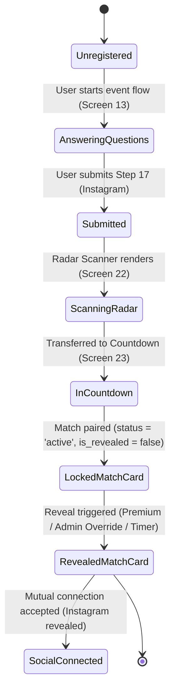

# STRING X — Matchmaking Architecture

> **Version:** 2.0.0  
> **Status:** APPROVED SPECIFICATION (PHASE 1 MANUAL MATCHING & PREMIUM REVEAL)  

---

## 1. Phase 1 Manual Matching vs Phase 2/3 AI Engine

STRING X is designed for a seamless evolutionary progression:

```
┌────────────────────────────────────────────────────────────────────────┐
│                        MATCHMAKING ROADMAP                             │
├───────────────────────────────────┬────────────────────────────────────┤
│ PHASE 1 (Current: 100-200 Users)  │ PHASE 2/3 (Scale & AI)             │
├───────────────────────────────────┼────────────────────────────────────┤
│ - Manual pairing by STRING X admin│ - Algorithmic / Vector similarity  │
│ - Admin pairs using SX001 user IDs│ - Automated batch pairing cron     │
│ - match_source = 'manual'         │ - match_source = 'ai'              │
│ - Master user directory inspection│ - Dynamic waitlists and re-rolls   │
│ - Synchronized pair premium reveal│ - Same database schema (matches)   │
└───────────────────────────────────┴────────────────────────────────────┘
```

The underlying database schema (`public.matches`) is normalized and shared across both phases, ensuring no schema rewrites when transitioning to automated AI matchmaking.

---

## 2. Match Lifecycle & Canonical Pair Model



### 2.1 Canonical Ordering (`user_a_id < user_b_id`)
To prevent reciprocal duplicate pairings (`SX001 -> SX002` and `SX002 -> SX001`), every match is canonically ordered:
- `user_a_id := LEAST(user_1, user_2)`
- `user_b_id := GREATEST(user_1, user_2)`
- Constrained by `CHECK (user_a_id < user_b_id)` and `UNIQUE (event_id, user_a_id, user_b_id)`.

### 2.2 Single Active Match per Event Guarantee
Each student can participate in at most one active match per campus event. Enforced at the database engine level via trigger `trg_check_single_active_match`.

### 2.3 Safe Match Reassignment
If an admin needs to alter a pairing (e.g. `SX001 <-> SX002` replaced by `SX001 <-> SX005`):
1. Old match record status is transitioned to `'replaced'`.
2. New match record is inserted with status `'active'`.
3. Historical data and audit trail are preserved without silent deletion.

### 2.4 Verification-Based Matching Access Control
String X enforces a strict separation between **General Application Access** and **Matchmaking Eligibility**:

1. **General App Access:** Rejection of identity verification does NOT ban or terminate account access. Students retain access to general campus feeds, event schedules, profile settings, and account management.
2. **Matching Gating Rule:**
   - `verification_status = 'pending'`: Eligible for matchmaking (treated as approved during review).
   - `verification_status = 'verified'`: Eligible for matchmaking.
   - `verification_status = 'rejected'`: **Matchmaking locked.** The student cannot register for new event matching or enter active matching radar.
3. **Correction & Re-Verification Flow:**
   - When a user with `verification_status = 'rejected'` attempts to start or resume matchmaking ("Find My Match"), the frontend dynamically directs them to the photo/selfie re-submission flow.
   - Submitting an updated profile photo via `submit_dp_verification(UUID)` or updated selfie via `submit_face_verification(...)` creates a fresh verification attempt, automatically resetting status to `'pending'` and immediately restoring matching eligibility.

---

## 3. Synchronized Pair-Level Reveal Model

### 3.1 Core Rule
A match between User A and User B is effectively revealed if:
$$\text{effective\_reveal} = \text{admin\_reveal} \lor \text{user\_a.is\_premium} \lor \text{user\_b.is\_premium} \lor (\text{event.status} = \text{'reveal\_phase'}) \lor (\text{now}() \ge \text{event.countdown\_target})$$

### 3.2 Synchronized Unlocking
- If either participant holds active premium status, **both participants see the revealed match**.
- The reveal flag is a property of the pair, not an asymmetric user-side toggle.
- Normal match views (`v_my_matches` and `v_matched_profiles`) enforce this server-side.

### 3.3 Admin Reveal Override
Administrators can activate `admin_reveal = true` on any match via the `admin_set_match_reveal()` RPC, immediately unlocking the pairing for both students.

---

## 4. Admin Workflow & Tooling

### 4.1 Master User Directory (`v_admin_users`)
Admins inspect the student directory presenting:
`User Code (SX001) | Full Name | Phone | Weight | Verification | Premium | Assigned Match | Reveal Status`

### 4.2 Automated Single-Value Match Assignment (Primary Phase 1 Workflow)
The primary operational workflow for administrators is setting `matched_with` on `public.event_registrations`:
- Setting `SX001.matched_with = 'SX005'` triggers `trg_sync_event_registration_match`.
- Automatically synchronizes reciprocal registration `SX005.matched_with = 'SX001'`.
- Automatically creates or updates canonical pair in `public.matches` (`user_a_id < user_b_id`, `status = 'active'`) and `public.connections`.
- Setting `matched_with = NULL` resets partner and marks match `'cancelled'`.

### 4.3 Assignment RPC (`admin_assign_match`)
Admins can also assign pairings directly via RPC:
```sql
SELECT public.admin_assign_match(
    p_event_id := 'c4e3b1a0-1234-5678-9abc-def012345678',
    p_user_1_code := 'SX001',
    p_user_2_code := 'SX002',
    p_score := 92,
    p_reasons := '["High Garba energy match", "Shared passion for Late Night Chai"]'::jsonb
);
```

### 4.4 Reassignment RPC (`admin_reassign_match`)
```sql
SELECT public.admin_reassign_match(
    p_event_id := 'c4e3b1a0-1234-5678-9abc-def012345678',
    p_old_match_id := 'f8a7b6c5-4321-8765-fedc-ba9876543210',
    p_new_partner_code := 'SX005',
    p_score := 95
);
```
