# STRING X — Onboarding Architecture

## 1. Onboarding Lifecycle Overview

The onboarding experience is divided into two distinct domains:

1. **Core Student Profile Onboarding (Screens 03 to 11):** Mandatory identity, physical stats, and security verification required of every student. Completing this unlocks the campus events ecosystem (`Screen 12: HomePage`).
2. **Event / Navratri Vibe Registration (Screens 13 to 21):** Festival-specific matchmaking questionnaire, partner preferences, and Instagram connection. Completing this unlocks the radar scanner and countdown partner reveal (`Screens 22 & 23`).

```mermaid
flowchart TD
    subgraph Core_Onboarding ["Core Profile Onboarding (Steps 0 to 8)"]
        S0["Step 00: Name & Gender (03)"] --> S1["Step 01: Campus & Hostel (04)"]
        S1 --> S2["Step 02: Age Selection (05)"]
        S2 --> S3["Step 03: Profile Photo (06)"]
        S3 --> S4["Step 04: Height & Weight (07)"]
        S4 --> S5["Step 05: Home State (08)"]
        S5 --> S6["Step 06: College Year (09)"]
        S6 --> S7["Step 07: Course Selection (10)"]
        S7 --> S8["Step 08: Face Verification (11)"]
    end

    subgraph Celebration ["Celebration & Home"]
        S8 --> Trans["FaceVerifiedTransition (1.5s)"]
        Trans --> Home["HomePage (Screen 12)"]
    end

    subgraph Event_Onboarding ["Navratri Event Questionnaire (Steps 9 to 17)"]
        Home -->|Find My Match| N9["Step 09: Partner Gender (13)"]
        N9 --> N10["Step 10: Campus Interests (14)"]
        N10 --> N11["Step 11: Evening Spot (15)"]
        N11 --> N12["Step 12: Navratri Excitement (16)"]
        N12 --> N13["Step 13: Garba Skill Level (17)"]
        N13 --> N14["Step 14: Navratri Vibes (18)"]
        N14 --> N15["Step 15: Personality Prompt 01 (19)"]
        N15 --> N16["Step 16: Personality Prompt 02 (20)"]
        N16 --> N17["Step 17: Instagram ID (21)"]
    end

    N17 --> Success["SubmissionSuccessPage (22)"]
    Success --> Countdown["CountdownPage (23)"]
```

---

## 2. Core Profile Steps (0 to 8)

### Step 0: Name & Gender (`Step01NameGender.tsx`, Screen 03)
- **Purpose:** Collect full display name and personal gender.
- **Fields:** `fullName` (`string`), `gender` (`'Female' | 'Male' | 'Non-binary' | 'Prefer not to say'`).
- **Validation:** `fullName.trim().length > 1 && (gender === 'Male' || gender === 'Female')`.
- **Local State:** Text input change buffer.
- **Persistent Data:** Updated to `profile` in `AuthContext` $\to$ `profileService.saveProfile()`.
- **Back Behavior:** Returns to Phone Sign-Up (`Screen 02`).
- **Next Route:** Step 1 (Screen 04).

---

### Step 1: Campus & Hostel (`Step02CampusHostel.tsx`, Screen 04)
- **Purpose:** Validate campus enrollment and living arrangement.
- **Fields:** `collegeName` (`string`), `hostel` (`string`).
- **Validation:** `collegeName === 'Parul University' && hostel.trim().length > 0`.
- **Local State:** Tab toggling (PU Campus vs Other Campus, Hostel search query).
- **Persistent Data:** Saved to profile.
- **Back Behavior:** Returns to Step 0.
- **Next Route:** Step 2 (Screen 05).

---

### Step 2: Age Check (`Step03Age.tsx`, Screen 05)
- **Purpose:** Set user age within campus eligibility bounds.
- **Fields:** `age` (`number`).
- **Validation:** `age >= 15 && age <= 28`.
- **Local State:** Slider / counter position.
- **Persistent Data:** Saved to profile.
- **Back Behavior:** Returns to Step 1.
- **Next Route:** Step 3 (Screen 06).

---

### Step 3: Profile Photo (`Step04Photo.tsx`, Screen 06)
- **Purpose:** Upload user photo or select from stylish festive avatar presets.
- **Fields:** `photoUrl` (`string`), `additionalPhotos` (`string[]`).
- **Validation:** `Boolean(photoUrl)`.
- **Local State:** Selected avatar ID, file upload preview buffer.
- **Persistent Data:** Image URL uploaded via `storageService.uploadPhoto()` or preset CDN URL.
- **Back Behavior:** Returns to Step 2.
- **Next Route:** Step 4 (Screen 07).

---

### Step 4: Combined Height & Weight (`Step05HeightWeight.tsx`, Screen 07)
- **Purpose:** Collect physical dimensions for Garba dance pairing and balance.
- **Fields:** `heightCm` (`number`), `weightKg` (`number`).
- **Validation:** `heightCm > 100 && weightKg > 0`.
- **Local State:** Vertical draggable ruler position, circular rotating weight dial angle.
- **Persistent Data:** Saved to profile.
- **Back Behavior:** Returns to Step 3.
- **Next Route:** Step 5 (Screen 08).

---

### Step 5: Home State (`Step06HomeState.tsx`, Screen 08)
- **Purpose:** Identify state/UT of origin for regional matching.
- **Fields:** `homeState` (`string`).
- **Validation:** `Boolean(homeState)`.
- **Local State:** Modal open state, state search query.
- **Persistent Data:** Saved to profile.
- **Back Behavior:** Returns to Step 4.
- **Next Route:** Step 6 (Screen 09).

---

### Step 6: College Year (`Step07CollegeYear.tsx`, Screen 09)
- **Purpose:** Academic stage verification.
- **Fields:** `collegeYear` (`'1st Year' | '2nd Year' | '3rd Year' | '4th Year' | 'PG'`).
- **Validation:** `Boolean(collegeYear)`.
- **Auto-Advance:** Auto-advances to next step after 240ms on card tap.
- **Persistent Data:** Saved to profile.
- **Back Behavior:** Returns to Step 5.
- **Next Route:** Step 7 (Screen 10).

---

### Step 7: Course Selection (`Step08Course.tsx`, Screen 10)
- **Purpose:** Department and faculty affiliation.
- **Fields:** `department` (`string`).
- **Validation:** `Boolean(department)`.
- **Local State:** Filtered course chips.
- **Persistent Data:** Saved to profile.
- **Back Behavior:** Returns to Step 6.
- **Next Route:** Step 8 (Screen 11).

---

### Step 8: Face Verification (`Step09FaceVerification.tsx`, Screen 11)
- **Purpose:** AI/ML facial authenticity check to prevent catfishing and bot accounts.
- **Fields:** `faceVerificationPhoto` (`string`), `isFaceVerified` (`boolean`).
- **Validation:** `faceVerificationPhoto && isFaceVerified === true`.
- **Local State:** WebRTC video stream, camera canvas, stabilization progress bar (0–100%), feedback hint string ("Position face in oval", "Hold steady").
- **Computer Vision:** Local Pico cascade classifier (`pico.ts`, `faceValidation.ts`) checking:
  1. Face oval containment.
  2. Tilt / roll threshold ($\le 12^\circ$).
  3. Continuous 1.25s stability before auto-shutter capture.
- **Persistent Data:** Photo uploaded via `storageService.uploadDataUrl()` $\to$ `isFaceVerified: true` saved to profile.
- **Next Route:** Triggers `FaceVerifiedTransitionPage` $\to$ automatically routes to **Screen 12 (`HomePage`)**.

---

## 3. Navratri Event Steps (9 to 17)

Accessible from `HomePage` via "Find My Match":
- **Step 9 (`NavratriStep01Partner`):** Partner gender preference (`'Girls' | 'Guys' | 'Open to Anyone'`). Back returns to `HomePage`.
- **Step 10 (`NavratriStep02Interests`):** General campus interests (1 to 6 tags).
- **Step 11 (`NavratriStep03EveningSpot`):** Favourite spot at PU. Auto-advances on select (240ms).
- **Step 12 (`NavratriStep04Excitement`):** PU Navratri excitement slider (0–100).
- **Step 13 (`NavratriStep05GarbaLevel`):** Skill rating (`Zero`, `A few steps`, `Pretty good`, `Garba Monster`). Auto-advances (240ms).
- **Step 14 (`NavratriStep06Vibes`):** Up to 3 festival excitement tags (Garba, Outfits/Photos, Late Night Food, Aarti).
- **Step 15 (`NavratriStep07Prompt1`):** Personality prompt: "Last round of the night". Auto-advances (260ms).
- **Step 16 (`NavratriStep08Prompt2`):** Personality prompt: "Garba persona". Auto-advances (260ms).
- **Step 17 (`NavratriStep09Instagram`):** Instagram handle (auto-prefixed with `@`).
- **Completion:** Navigates to **Screen 22 (`SubmissionSuccessPage`)**.
