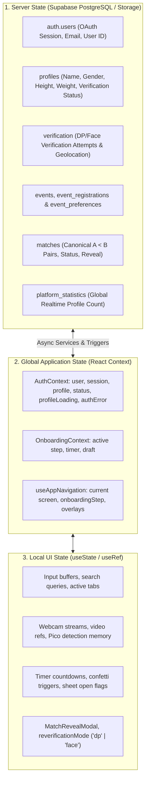
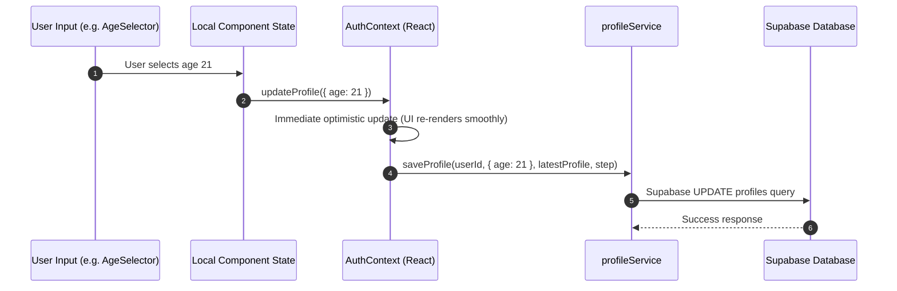

# STRING X — State Management Architecture

> **Version:** 3.0.0  
> **Status:** APPROVED ARCHITECTURAL SPECIFICATION (STATE SCOPES & DEDUPLICATION)  

---

## 1. State Classification Matrix

STRING X follows a strict rule on state scope: **Keep state as local as possible, and elevate only when multiple unrelated domains require access.**

---

## 2. What Belongs Where?

### 2.1 What Belongs in Server State (Supabase)?
- Anything that must survive device restarts or session re-logins:
  - Account email, Parul University enrollment number, and Supabase user UUID.
  - Profile identity: Full name, campus, hostel, department, year, age, home state.
  - Physical stats: Height (cm) and weight (kg).
  - Security & verification artifacts: Verification attempts in `public.verification`, photo paths, geolocation telemetry, and verification states (`pending`, `verified`, `rejected`).
  - Questionnaire answers: `event_preferences` (partner gender preference, excitement vibes, garba energy, prompts, Instagram ID).
  - Match pairings and connections (`public.matches`, `public.connections`).
  - Aggregate counter in `public.platform_statistics`.

### 2.2 What Belongs in Global React State?
- User authentication status (`'loading' | 'authenticated' | 'unauthenticated'`).
- The active in-memory `UserProfile` object to avoid repeated database refetches on every step transition.
- In-flight promise deduplication cache (`inFlightProfilePromiseRef`) in `AuthContext` to prevent redundant parallel profile loads.
- Global error notices (`authError`: title, message).
- Route controller state (`screen`, `onboardingStep`, `isShowingVerifiedTransition`).

### 2.3 What Belongs in Local Component State?
- **Temporary Text Buffers:** While typing in a search bar or Instagram handle field before blur/submit.
- **Re-Verification Modes:** `reverificationMode` (`'dp' | 'face' | null`) tracking when a user from Home is updating their rejected asset.
- **Micro-Animations & UI Toggles:**
  - Active tab selection in campus filters (`selectedCategory`).
  - Active rotating dial angle in `WeightDialCircle`.
  - Confetti blast triggers.
- **Hardware & Media State:**
  - WebRTC video stream tracks and canvas analysis frames in `FaceVerificationCamera`.
  - Auto-advance timeout timer handles (`advanceTimerRef`).

### 2.4 What Must NEVER Be Global?
- **Step auto-advance timers:** Must remain local to the step runner with clean unmount effect hooks.
- **Camera video frames:** Storing image buffers in global state causes massive React re-render lag.
- **Temporary modal visibilities:** Modal state should reside within the page or component triggering it.

---

## 3. State Synchronization Lifecycle

1. **Optimistic Local Response:** When a user selects an option (e.g. college year), `updateProfile` immediately applies the change to memory so the UI remains fluid.
2. **Background Persistence:** The service layer asynchronously synchronizes the field to Supabase PostgreSQL or local draft storage.
3. **Draft Recovery:** If a user accidentally closes their browser tab mid-onboarding, `onboardingService.getDraft()` restores uncommitted values upon re-opening.
