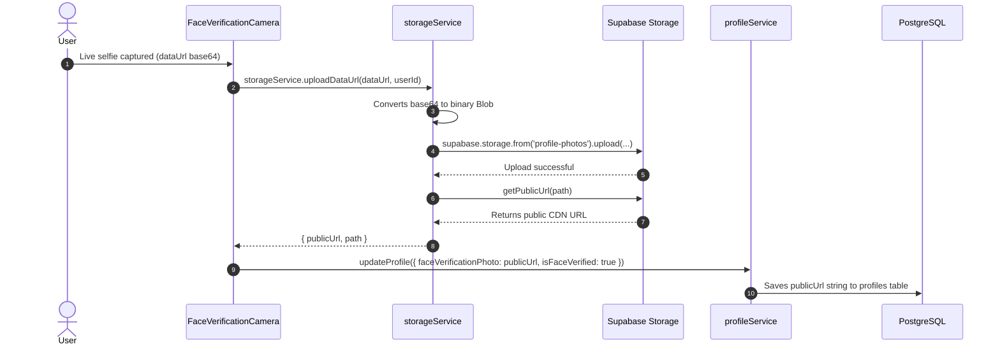

# STRING X — Cloud Storage Architecture

## 1. Storage Overview

STRING X utilizes **Supabase Storage** for managing binary media. 

**Critical Architectural Rule:**
Binary image blobs must **NEVER** be stored directly inside PostgreSQL columns. PostgreSQL only stores the sanitized URL or bucket path reference (`photo_url`, `face_verification_photo`).

---

## 2. Bucket Configuration

### `profile-photos` Bucket
- **Access Level:** Public read (for profile photos), Authenticated upload.
- **Max File Size:** 5MB.
- **Accepted MIME Types:**
  - `image/jpeg` (`.jpg`, `.jpeg`)
  - `image/png` (`.png`)
  - `image/webp` (`.webp`)

---

## 3. File Path Conventions

To enforce isolation between students and avoid filename collisions:

```
profile-photos/
└── <user_id>/
    ├── photo_<timestamp>.jpg              # Primary profile photo
    └── face_verification_<timestamp>.jpg  # Live webcam verification selfie
```

- Every upload path is scoped under the student's unique `user_id` folder.
- Timestamps prevent client-side browser cache staleness when a student updates their picture.

---

## 4. Upload Flow & Service Integration



---

## 5. Storage Security & RLS Policies

Configured via Supabase SQL:

```sql
-- 1. Allow public read access to all profile photos
CREATE POLICY "Public Read Profile Photos"
ON storage.objects FOR SELECT
USING (bucket_id = 'profile-photos');

-- 2. Allow authenticated users to upload only into their own user_id folder
CREATE POLICY "User Upload Profile Photos"
ON storage.objects FOR INSERT
TO authenticated
WITH CHECK (
  bucket_id = 'profile-photos' AND
  (storage.foldername(name))[1] = auth.uid()::text
);

-- 3. Allow users to delete their own photos
CREATE POLICY "User Delete Profile Photos"
ON storage.objects FOR DELETE
TO authenticated
USING (
  bucket_id = 'profile-photos' AND
  (storage.foldername(name))[1] = auth.uid()::text
);
```

---

## 6. Offline / Mock Mode Handling

In `src/services/storageService.ts`:
- If Supabase environment variables are missing, `uploadPhoto()` automatically invokes `URL.createObjectURL(fileOrBlob)`.
- If an image is passed as a data URL (webcam capture), it returns the data URL directly.
- The UI components remain completely agnostic to cloud storage latency or configuration.
